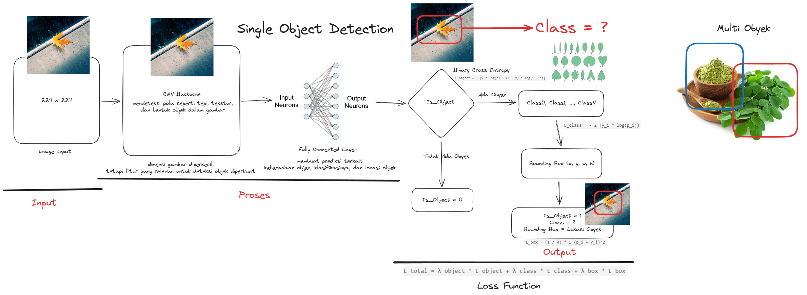

# Single Object Detection

Single Object Detection adalah teknik dalam computer vision yang digunakan untuk mendeteksi satu objek dalam sebuah gambar atau video. Proses ini melibatkan deteksi dan klasifikasi objek yang ada dalam gambar berdasarkan model yang sudah dilatih.

## Penjelasan Gambar

Gambar di atas menunjukkan alur kerja dari sistem deteksi objek. Langkah-langkah umum dalam deteksi objek adalah:
1. **Input Gambar**: Gambar yang akan diproses dimasukkan ke dalam model.
2. **Preprocessing**: Mengolah gambar untuk memperbaiki kualitas gambar dan memudahkan deteksi.
3. **Deteksi Objek**: Model akan memprediksi objek yang ada dalam gambar.
4. **Bounding Box**: Menandai lokasi objek yang terdeteksi dengan kotak.
5. **Output**: Menampilkan gambar dengan objek yang terdeteksi dan labelnya.

## Tools dan Resources

Untuk mempermudah pengujian dan eksperimen dalam deteksi objek, Anda dapat menggunakan beberapa tools dan platform berikut:

- [Ngrok](https://ngrok.com/): Platform untuk membuat secure tunnels yang memungkinkan Anda mengakses aplikasi lokal melalui internet.
- [Hoppscotch](https://hoppscotch.io/): Sebuah API testing tool yang mempermudah pengujian API dan endpoint.
- [Base64 to Image Converter](https://codebeautify.org/base64-to-image-converter): Platform untuk mengkonversi string base64 menjadi gambar yang dapat diunduh.